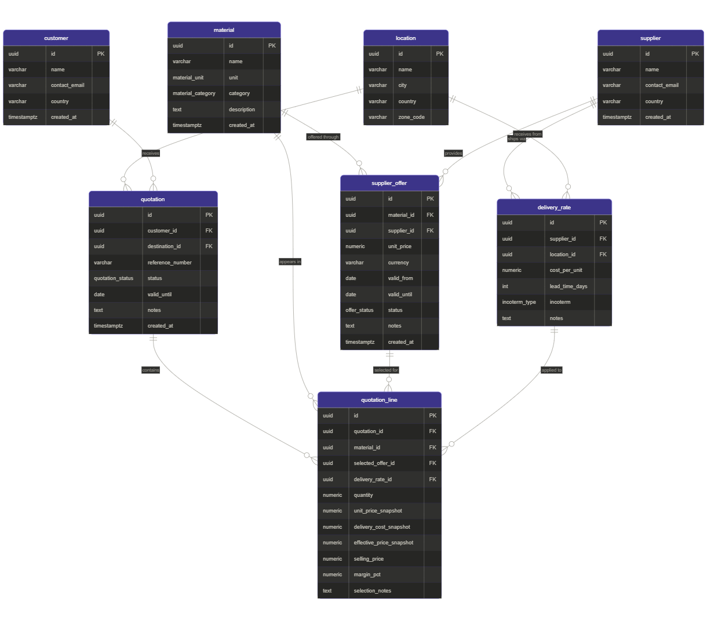
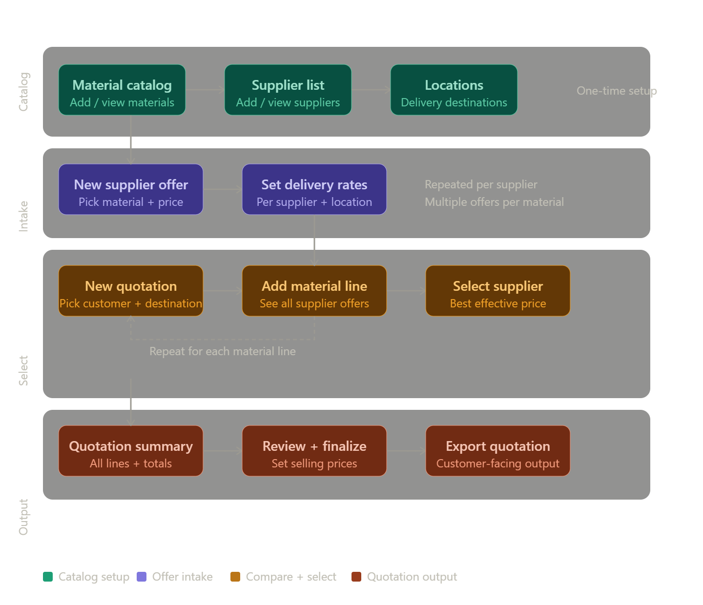

# Cursor Agent Prompt — Generate Professional README

---

Generate a professional, visually rich `README.md` file for a project called **SupplyQ — Mini Supply-to-Quotation System**. This is a submission for a full-stack developer technical assessment. The README must impress the hiring company technically and visually. Use GitHub-flavored Markdown exclusively.

---

## Content to include (use ALL of this, rewritten into clean professional prose):

### Project identity
- **Name:** SupplyQ
- **Subtitle:** Mini Supply-to-Quotation System
- **Purpose:** An internal commercial tool that allows a supply/procurement team to manage a material catalog, intake supplier quotations, compare multi-supplier offers with delivery-aware pricing, and generate clean customer-facing quotation outputs.
- **Built as:** a full-stack developer technical assessment

### Tech stack badges (render at the very top using shields.io badge syntax)
Include badges for: React, TypeScript, Tailwind CSS, Supabase, TanStack Query, Zod, Framer Motion, Shadcn UI, Vite

Example badge format:


Use appropriate logo names and brand colors for each badge.

---

## README Structure (follow this exact section order):

### 1. Header
- Project name as H1 with a ⚡ emoji
- One-line description
- All tech stack badges in a single line
- A horizontal rule after

### 2. Overview
Rewrite this into a compelling 3–4 sentence paragraph:
"This is not just a quotation builder. The real challenge is designing a small system that handles a material catalog, supplier quotation intake, same item offered by multiple suppliers, delivery variability by location, supplier comparison and selection, quotation line resolution from supplier choices, and a clean UX on top of more complex underlying logic."

### 3. Clarifying Questions (before building)
Intro line: "Before writing a single line of code, I submitted the following clarifying questions to identify the real complexity of the system:"

Present as a numbered list with bold question titles:

1. **What is a "Location"?** — Is this the customer's delivery address, a fixed warehouse zone, or a configurable destination? This determines whether Location is a free-text field, a managed catalog, or tied to the customer entity. Getting this wrong breaks the entire delivery pricing model.
2. **How is delivery cost structured per supplier?** — Is it a flat fee per shipment, cost per unit/kg, or a percentage of order value? And is it per supplier-to-location pair, or does it vary by material too? This determines whether DeliveryRate is a simple table or a complex matrix.
3. **Does "effective price" mean base price + delivery cost, or is there a margin/markup layer on top?** — The requirement says "customer quotation output," which implies a selling price — not just cost. Do we track margin as part of the quotation line?
4. **Can a supplier offer have an expiry date?** — Real-world supplier quotes are valid for a limited time. If yes, the system needs validity tracking and expiry warnings during comparison.
5. **Is there a quantity dimension?** — Do supplier prices break by quantity (1–100 units: $10, 100+: $8)? This is the single biggest data model fork. Flat price vs. price-break tiers are entirely different schemas.
6. **Who are the users and do they have roles?** — One internal team, or distinct procurement vs. commercial roles? This affects UX flow and whether access control is needed.
7. **Can a single quotation contain lines from different suppliers?** — This determines whether supplier selection happens at the quotation level or the line level — a fundamental structural choice.
8. **What currency model are we dealing with?** — Single currency or multi-currency with conversion? Multi-currency is a significant complexity jump.
9. **What does "customer quotation output" look like?** — PDF document, printable screen view, or exportable format? This affects the output layer design.
10. **Should the system remember which supplier was selected and why?** — Is selection a click, or should the rationale (lower price, faster lead time) be stored for future reference?

### 4. Assumptions
Intro line: "Since answers were not guaranteed, I proceeded with the following documented assumptions — all designed to be reversible:"

Present as a bullet list:
- **Location** is a managed catalog entity (city/country), not free-text — keeps delivery pricing clean and queryable.
- **Delivery cost** is a flat additional cost per unit, stored as a DeliveryRate per supplier-per-location pair.
- **Effective price** = supplier_unit_price + delivery_cost_per_unit. Selling price = effective price + margin (stored per quotation line).
- **No quantity breaks** — flat unit price per supplier offer. Tiers are a clean next-step extension.
- **No offer auto-expiry enforcement** in MVP — valid_until is stored but not enforced. Enforcement is a UI warning layer for later.
- **Single internal team** — no role-based access control in MVP. Schema is ready for RLS expansion.
- **Mixed-supplier quotations** — supplier selection happens per line, not per quotation. This is the more realistic model.
- **Single currency (USD)** — multi-currency needs a live FX feed, which is post-MVP scope.
- **Quotation output** is a clean screen view with print support — no PDF generation in MVP.
- **Selection rationale** stored as a free-text notes field on the quotation line.

### 5. Data Model
Section title: ## Data Model & Architecture

Include this image reference exactly:


Then write these architecture notes as subsections:

**SUPPLIER_OFFER is a first-class entity, not a junction table**
It carries price, validity dates, status, and notes. A mere junction table cannot track lifecycle or history. Treating it as a business object enables future offer versioning, expiry management, and audit logging.

**DELIVERY_RATE is deliberately decoupled from SUPPLIER_OFFER**
A supplier's delivery cost to Cairo is the same regardless of which material they are shipping. Embedding delivery in the offer would mean duplicating that $5/unit across every offer that supplier has. Separating it means a shipping rate change is one row update, not fifty.

**QUOTATION_LINE stores price snapshots**
unit_price_snapshot, delivery_cost_snapshot, effective_price_snapshot freeze the commercial reality at the moment of quotation creation. If a supplier raises their price tomorrow, old quotations remain historically accurate. The database enforces this with a CHECK constraint: effective_price_snapshot = unit_price_snapshot + delivery_cost_snapshot — this cannot be violated even by a bug.

**Foreign key strategy**
ON DELETE RESTRICT on all supplier and material references — you cannot delete a supplier with active offers or a material that appears in quotations. ON DELETE CASCADE only on quotation_line — deleting a quotation header safely cleans up its lines.

Then include a collapsible full table reference using HTML details/summary:

<details>
<summary>Full table reference (8 tables)</summary>

| Table | Purpose |
|---|---|
| material | Catalog of all buyable/sellable materials |
| supplier | Registered supplier companies |
| location | Delivery destination catalog (city/country) |
| customer | End customers who receive quotations |
| supplier_offer | A supplier's priced offer for a specific material |
| delivery_rate | Delivery cost per supplier per destination |
| quotation | Customer quotation header (customer + destination + status) |
| quotation_line | One resolved material line with frozen price snapshots |

</details>

### 6. Core Logic
Section title: ## Core Business Logic

Present 4 pseudocode blocks with typescript syntax highlighting and a caption under each:

Block 1 — Effective price calculation:
```typescript
function getEffectivePrice(supplierId, materialId, destinationId):
  offer = query SUPPLIER_OFFER where supplier_id = supplierId
          AND material_id = materialId AND status = 'active'
  rate  = query DELIVERY_RATE where supplier_id = supplierId
          AND location_id = destinationId
  effective_price = offer.unit_price + (rate?.cost_per_unit ?? 0)
  return { offer, rate, effective_price }
```
Caption: If no delivery rate exists for a supplier-destination pair, delivery is treated as free (0) — the system does not block the quotation.

Block 2 — Multi-supplier comparison:
```typescript
function compareOffersForMaterial(materialId, destinationId):
  offers = query all SUPPLIER_OFFER where material_id = materialId
           AND status = 'active'
  for each offer:
    rate = query DELIVERY_RATE where supplier_id = offer.supplier_id
           AND location_id = destinationId
    compute effective_price = offer.unit_price + (rate?.cost_per_unit ?? 0)
  return sorted by effective_price ascending, mark is_cheapest on first row
```

Block 3 — Quotation line resolution (snapshot freeze):
```typescript
function resolveQuotationLine(quotationId, materialId, selectedOfferId,
                               deliveryRateId, quantity, sellingPrice):
  offer = fetch SUPPLIER_OFFER by selectedOfferId
  rate  = fetch DELIVERY_RATE by deliveryRateId  // nullable
  insert QUOTATION_LINE {
    unit_price_snapshot:      offer.unit_price,
    delivery_cost_snapshot:   rate?.cost_per_unit ?? 0,
    effective_price_snapshot: offer.unit_price + (rate?.cost_per_unit ?? 0),
    selling_price:            sellingPrice,
    margin_pct: ((sellingPrice - effective_price) / effective_price) * 100
  }
```

Block 4 — Quotation summary:
```typescript
function buildQuotationSummary(quotationId):
  lines         = query all QUOTATION_LINE where quotation_id = quotationId
  total_cost    = sum(line.effective_price_snapshot * line.quantity)
  total_revenue = sum(line.selling_price * line.quantity)
  total_margin  = ((total_revenue - total_cost) / total_cost) * 100
  return { lines, total_cost, total_revenue, total_margin }
```

### 7. User Journey
Section title: ## User Journey

Include this image reference exactly:


Then write 4 phases as bold headers with 2-sentence prose each:

**Phase 1 — Catalog Setup (one-time)**
The user registers materials, suppliers, delivery locations, and customers. This is the foundation layer — nothing else in the system works without it.

**Phase 2 — Supplier Offer Intake**
The user records each supplier's priced offer for each material with validity dates. Delivery rates are configured per supplier-location pair, and multiple suppliers can offer the same material at competing prices.

**Phase 3 — Quotation Building (the core flow)**
The user creates a quotation header (customer + destination), then adds material lines one by one. For each line, the system presents a live comparison table showing every active supplier's base price, delivery cost to the selected destination, and computed effective price — sorted cheapest first — so the user can make an informed selection.

**Phase 4 — Quotation Output**
The resolved quotation shows all lines with margin percentages color-coded (green above 20%, amber 10–20%, red below 10%) and a full cost/revenue summary. A clean customer-facing view hides internal cost data and supports direct browser printing.

Then add this as a blockquote:
> **Design principle:** The user never sees database complexity. The comparison modal surfaces a single "effective price" number per supplier. The snapshot mechanism is invisible. The UX is a 4-step journey built on top of an 8-table data model.

### 8. Project Structure
Section title: ## Project Architecture

Show this exact folder tree in a code block (no language tag):
```
src/
├── api/              # All Supabase calls — isolated from components
│   ├── materials.ts
│   ├── suppliers.ts
│   ├── supplierOffers.ts
│   ├── deliveryRates.ts
│   ├── quotations.ts
│   └── quotationLines.ts
├── hooks/            # React Query hooks — consume api/ only
│   ├── useMaterials.ts
│   ├── useSupplierOffers.ts
│   └── useQuotations.ts
├── components/
│   ├── layout/       # AppLayout, Sidebar, Topbar
│   ├── shared/       # DataTable, EmptyState, StatusBadge, ConfirmDialog
│   ├── materials/
│   ├── suppliers/
│   ├── offers/
│   ├── delivery/
│   └── quotations/   # QuotationLineRow, SupplierCompareModal, QuotationSummary
├── pages/            # Route-level components
├── store/            # Zustand — UI state only (sidebar, modal flags)
├── lib/              # supabase.ts, queryKeys.ts, pricing.ts, format.ts
└── types/            # entities.ts, enums.ts, database.types.ts
```

Then write this as a blockquote:
> **Key rule:** No Supabase imports exist outside `src/api/`. Components receive data through hooks only. Hooks call api functions. Api functions call Supabase. If the backend changes, only one folder is touched.

### 9. Tradeoffs & Next Steps
Section title: ## Tradeoffs & What I Would Build Next

**What I simplified for MVP** — present as a table:

| Simplification | Reasoning |
|---|---|
| No offer auto-expiry enforcement | valid_until is stored; enforcement is a UI warning layer for the next phase |
| No authentication / RLS roles | Schema is RLS-ready; role policies are a one-step addition |
| No audit trail on price changes | An offer_history table is the first post-MVP addition |
| Single currency (USD) | Multi-currency needs a live FX feed — a separate system concern |
| No PDF export | Browser print view is sufficient for prototype validation |
| Flat unit pricing only | A PRICE_BREAK child table on supplier_offer is a clean extension point |

**What I would build next (in priority order)** — present as a numbered list:
1. offer_status_history and quotation_status_history tables for full lifecycle tracking
2. Row Level Security policies separating procurement and commercial team access
3. price_break table on supplier_offer for quantity-based pricing tiers
4. Offer expiry warnings: "Supplier offer for Steel Pipe expires in 7 days"
5. PDF export via headless renderer once the data model is proven in production
6. Multi-currency support with a managed FX rate table

### 10. Getting Started
Section title: ## Getting Started

```bash
# 1. Clone the repository
git clone <repo-url>
cd supplyq

# 2. Install dependencies
npm install

# 3. Configure environment variables
cp .env.example .env.local
# Set VITE_SUPABASE_URL and VITE_SUPABASE_ANON_KEY

# 4. Start the development server
npm run dev
```

Add this note as a blockquote:
> The database schema (`schema.sql`) and seed data (8 CSV files) are included in the repository. Import order is critical due to foreign key constraints: `material` → `supplier` → `location` → `customer` → `supplier_offer` → `delivery_rate` → `quotation` → `quotation_line`.

### 11. Footer
End with a horizontal rule, then:
---
*Built with precision for a full-stack developer technical assessment.*

---

## Strict formatting rules (apply throughout without exception):

1. Use ## for all main sections, ### for subsections — never skip levels
2. Every code block must have a language tag (typescript, bash, sql) — except the folder tree which uses no tag
3. Use tables wherever a list has more than 2 attributes per item
4. Use > blockquotes for design principles, architectural decisions, and key insights
5. Use **bold** for entity/table names, field names, and key terms on first mention
6. No bullet point longer than 2 lines — if longer, convert to prose paragraph
7. Tone: precise, senior, confident. Not casual. Not over-explained. Not padded.
8. Do not add any sections not listed above
9. Do not add placeholder text like "[your name here]" or "[add screenshot]"
10. The README should feel written by a senior engineer who respects the reader's time

---

## Final verification before saving:

- Both image references point to ./public/erd-diagram.png and ./public/user-journey.png exactly
- All 8 table names match the actual schema: material, supplier, location, customer, supplier_offer, delivery_rate, quotation, quotation_line
- All shields.io badges use the correct logo slugs and hex colors
- File is saved as README.md in the project root
- No section is missing from the order defined above
